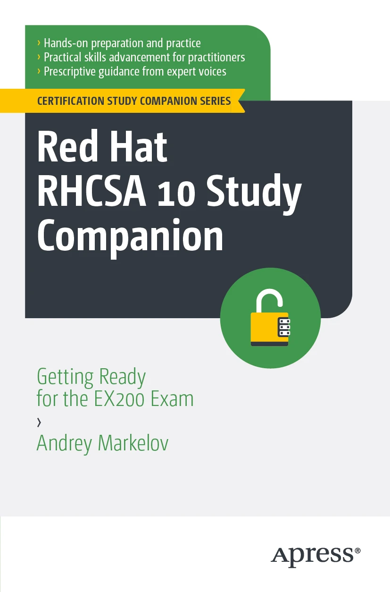

# Book Exercises

This repository contains bash scripts for exercises accompanying the book [**Red Hat RHCSA 10 Study Companion**](https://link.springer.com/book/9798868822254): *Getting Ready for the EX200 Exam* by Andrey Markelov (May 2026).

<a href="https://link.springer.com/book/9798868822254"></a>

Answers are also available on GitHub Pages for easy browsing: https://andreyamarkelov.github.io/adminbook/

## Before you run anything

**Use a disposable lab VM only.** Many scripts create users, change `/etc/fstab`, reconfigure networking, modify firewalld, or adjust SELinux. Do not run them on a production system or your daily machine.

| Requirement | Details |
|-------------|---------|
| **Target OS** | RHEL 10 (or a compatible RHCSA practice VM) — see [lab VM setup guide](https://andreyamarkelov.github.io/adminbook/lab-vm-setup.html) on GitHub Pages |
| **Privileges** | Many scripts use `sudo` or require root |
| **Extra disk** | Storage chapters assume an unpartitioned disk at `/dev/sdb` |
| **Snapshots** | Take a VM snapshot before each chapter when possible |

### Script types

Each script includes metadata in its header:

```bash
# @type: executable | instructional
# @requires: none | root | /dev/sdb | root, /dev/sdb
# @safe: yes | no
```

- **`instructional`** — prints the commands to run manually (for example interactive `fdisk` / `parted` walkthroughs). These scripts do not change the system.
- **`executable`** — runs commands directly. `@safe: no` means the script performs mutating actions (creates users, mounts disks, changes firewall rules, etc.). Read-only commands such as `man`, `ps`, `dnf list`, or pipelines over `/etc/passwd` are marked `@safe: yes`.

### Running a script

```bash
chmod +x chapter_N/exercise_MM.sh
./chapter_N/exercise_MM.sh
```

Some chapter 3 scripts require arguments; see the usage message in each file. Chapter 2 exercise 5 launches interactive `vimtutor`. Chapter 4 exercise 6 opens `visudo` for manual editing.

## Structure

Chapter titles and topics are defined in [`chapters.yaml`](chapters.yaml) (single source of truth for the GitHub Pages site). Exercises are organized by chapter:

```
adminbook/
├── chapters.yaml   # Chapter metadata
├── chapter_2/    (5 exercises + 3 extra)  - Basic Linux commands and documentation
├── chapter_3/    (5 exercises + 3 extra)  - Bash scripting fundamentals
├── chapter_4/    (6 exercises)  - User and group management
├── chapter_5/    (5 exercises)  - Disk partitioning and LVM
├── chapter_6/    (6 exercises)  - Filesystems and permissions
├── chapter_7/    (6 exercises)  - System services and processes
├── chapter_8/    (9 exercises)  - Job scheduling and SSH
├── chapter_9/    (10 exercises) - Package management (DNF, RPM, Flatpak)
├── chapter_10/   (14 exercises) - Networking and firewall
└── chapter_11/   (4 exercises)  - SELinux
```

**Total: 76 executable bash scripts**

## Chapter Topics

### Chapter 2: Documentation and Basic Commands
- Man pages, info pages
- Bash aliases
- Find command and pipes
- Vim tutorial

### Chapter 3: Bash Scripting
- Argument processing
- File and directory operations
- Conditional statements and loops
- Test operators

### Chapter 4: User and Group Management
- Creating users and groups
- User modification and deletion
- Password aging policies
- Sudo configuration

### Chapter 5: Disk Management and LVM
- Disk partitioning (fdisk)
- Physical volumes and volume groups
- Logical volumes
- LVM cleanup

### Chapter 6: Filesystems and Storage
- GPT partitioning (parted)
- XFS filesystem
- fstab configuration
- SGID permissions
- Swap files

### Chapter 7: System Management
- Systemd targets
- Journal logs
- Process management (ps, nice, renice)
- TuneD profiles

### Chapter 8: Task Scheduling and Remote Access
- Background jobs
- at command
- Cron jobs
- Time management (timedatectl)
- SSH key generation and configuration

### Chapter 9: Package Management
- DNF operations
- RPM queries
- Repository management
- Flatpak applications

### Chapter 10: Networking
- Network interface configuration
- NetworkManager (nmcli)
- Static and DHCP configurations
- Hostname and DNS management
- Firewall configuration (firewall-cmd)

### Chapter 11: SELinux
- SELinux contexts
- File and port labeling
- SELinux booleans

## Contributing

See [CONTRIBUTING.md](CONTRIBUTING.md) for script conventions, local validation, and pull request guidelines.

## Source

Original repository: https://github.com/andreyamarkelov/adminbook
